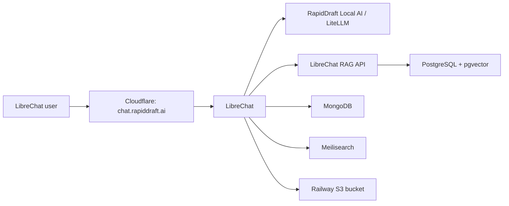

# RapidDraft LibreChat on Railway

This repository contains the non-secret configuration and repeatable provisioning tools for the LibreChat deployment in Railway project `bk-RAG-test`, environment `testing`.

- Application: <https://chat.rapiddraft.ai>
- Railway project: <https://railway.com/project/45bb0e8d-9eca-4973-8026-a3eddbd092b6?environmentId=6c80a4d1-c8e3-4410-b712-a27f89012046>
- Administrator: `adeel@rapiddraft.ai`
- Local AI provider: `RapidDraft Local AI`
- Chat model: `local/qwen-coder`

## Architecture



MongoDB, Meilisearch, PostgreSQL/RAG, and object storage are separate Railway services with persistent storage. LibreChat is configured with `ENDPOINTS=agents,custom`; both values are required for Agents and the RapidDraft endpoint to appear together.

## Isolated knowledge bases

Each knowledge base is a private LibreChat Agent with its own files and access-control group:

| Agent | Access group | Files | Source |
| --- | --- | ---: | --- |
| `Test Archive` | `KB - Test Archive` | 41 | Existing indexed Local AI archive (610 preserved chunks) |
| `Bauer Kompressoren` | `KB - Bauer Kompressoren` | 373 | 550 PDF/HTML inputs, reduced to 373 exact unique sources; 35 PDFs required OCR |

The Agents are not public. Each is granted `agent_viewer` access only through its matching group, and their file-ID sets are disjoint. The administrator is a member of both groups.

### Selecting a knowledge base

In LibreChat, start a new chat and select the required Agent:

1. Choose **Test Archive** for Test Archive questions.
2. Choose **Bauer Kompressoren** for Bauer questions.
3. Start a new conversation when changing knowledge bases so the conversation history also stays company/project-specific.

The selected Agent searches only its attached files. It is deliberately instructed to say when an answer is absent instead of filling gaps from another knowledge base or general model knowledge.

### Adding another company or project

Use the same isolation unit for every future corpus:

1. Create a group named `KB - <company or project>` and add only the permitted users.
2. Create one private Agent named for that company/project, using provider `RapidDraft Local AI`, model `local/qwen-coder`, and tool `file_search`.
3. Attach only that corpus's files to that Agent. Never reuse another Agent's file associations.
4. Share the Agent with only its matching group as `agent_viewer`; do not make it public.
5. Verify every file is embedded, file IDs do not intersect with another Agent, and run positive grounded queries before granting access.

This is logical isolation inside one LibreChat installation. If contractual or regulatory separation requires independent encryption keys, administrators, backups, or databases, deploy a separate LibreChat/RAG stack instead.

## Secrets and administrator credential

Runtime secrets are injected through Railway and are never committed. These include the scoped Local AI chat/embedding keys and all MongoDB, Meilisearch, PostgreSQL, and object-storage credentials.

The administrator password is stored as a Windows DPAPI-encrypted PowerShell credential at:

```text
D:\02_Code\auth\auth\librechat\testing-admin.credential.xml
```

It is readable only by the Windows user who created it. To load it without printing the password:

```powershell
$credential = Import-Clixml 'D:\02_Code\auth\auth\librechat\testing-admin.credential.xml'
```

`scripts/bootstrap-librechat-admin.ps1` creates or verifies the administrator. Registration is closed after bootstrap (`ALLOW_REGISTRATION=false`), and violation banning is enabled (`BAN_VIOLATIONS=true`).

## Provisioning tools

- `scripts/export-test-archive.ps1` exports the indexed Test Archive through the scoped SSH account and preserves its chunk metadata as Markdown.
- `scripts/prepare-bauer-corpus.py` hashes and deduplicates PDF/HTML sources, extracts text, runs OCR for image-only PDFs, and writes a manifest.
- `scripts/provision-knowledge-bases.ps1` idempotently creates/synchronizes groups and Agents, resumes uploads by checksum, repairs committed-upload interruptions, rejects duplicates, verifies embedding and isolation, and optionally runs real grounded chat tests.
- `scripts/test-localai-tool-calling.ps1` forces a direct OpenAI-compatible tool call against the scoped Local AI endpoint.

Generated corpora, manifests, dependencies, and resume state live under `tmp/` and are intentionally ignored by Git.

Typical validation after the initial import:

```powershell
.\scripts\provision-knowledge-bases.ps1 -SkipUploads -RunQueryTests
```

Full resume-safe provisioning and verification:

```powershell
.\scripts\provision-knowledge-bases.ps1 -RunQueryTests
```

The resume state is bound to the canonical Railway hostname to prevent accidentally applying file IDs to a different LibreChat instance. The public custom hostname points to the same verified service.

## Acceptance checks

The final deployment was verified on 2026-07-19 with:

- GitHub, Railway, Cloudflare, and scoped SSH access checks;
- direct Local AI chat, embedding, and forced tool-call requests;
- LibreChat and custom-domain health checks over HTTPS;
- administrator login with registration closed and violation protection enabled;
- 41/41 Test Archive and 373/373 Bauer files embedded;
- zero shared file IDs between the Agents;
- a live `file_search` response from each Agent using a corpus-specific question;
- temporary upload-limit overrides removed and the temporary MongoDB maintenance proxy deleted.
