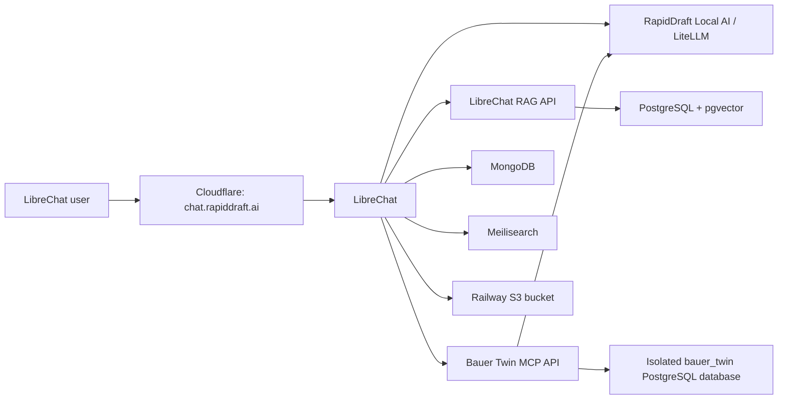

# RapidDraft LibreChat on Railway

This repository contains the non-secret configuration and repeatable provisioning tools for the LibreChat deployment in Railway project `bk-RAG-test`, environment `testing`.

- Application: <https://chat.rapiddraft.ai>
- Railway project: <https://railway.com/project/45bb0e8d-9eca-4973-8026-a3eddbd092b6?environmentId=6c80a4d1-c8e3-4410-b712-a27f89012046>
- Administrator: `adeel@rapiddraft.ai`
- Local AI provider: `RapidDraft Local AI`
- Chat model: `local/qwen-coder`

## Architecture



MongoDB, Meilisearch, PostgreSQL/RAG, and object storage are separate Railway services with persistent storage. LibreChat is configured with `ENDPOINTS=agents,custom`; both values are required for Agents and the RapidDraft endpoint to appear together.

## Isolated knowledge bases

Each knowledge base is a private LibreChat Agent with its own files and access-control group:

| Agent | Access group | Files | Source |
| --- | --- | ---: | --- |
| `Test Archive` | `KB - Test Archive` | 41 | Existing indexed Local AI archive (610 preserved chunks) |
| `Bauer Kompressoren` | `KB - Bauer Kompressoren` | 373 | 550 PDF/HTML inputs, reduced to 373 exact unique sources; 35 PDFs required OCR |

The Bauer Agent also has an authenticated structured tool for the first demo scope: similar historical-project search plus document/part search. Its vertical slice contains 12 synthetic projects, 75 synthetic parts, and 8 public evidence links. Synthetic identifiers begin with `SYN-` and must never be represented as confirmed Bauer internal data.

The Agents are not public. Each is granted `agent_viewer` access only through its matching group, and their file-ID sets are disjoint. The administrator is a member of both groups.

### Selecting a knowledge base

In LibreChat, start a new chat and select the required Agent:

1. Choose **Test Archive** for Test Archive questions.
2. Choose **Bauer Kompressoren** for Bauer questions.
3. Start a new conversation when changing knowledge bases so the conversation history also stays company/project-specific.

The selected Agent searches only its attached files. It is deliberately instructed to say when an answer is absent instead of filling gaps from another knowledge base or general model knowledge.

### Adding another company or project

Use the same isolation unit for every future corpus:

1. Create a group named `KB - <company or project>` and add only the permitted users.
2. Create one private Agent named for that company/project, using provider `RapidDraft Local AI`, model `local/qwen-coder`, and tool `file_search`.
3. Attach only that corpus's files to that Agent. Never reuse another Agent's file associations.
4. Share the Agent with only its matching group as `agent_viewer`; do not make it public.
5. Verify every file is embedded, file IDs do not intersect with another Agent, and run positive grounded queries before granting access.

This is logical isolation inside one LibreChat installation. If contractual or regulatory separation requires independent encryption keys, administrators, backups, or databases, deploy a separate LibreChat/RAG stack instead.

## Secrets and administrator credential

Runtime secrets are injected through Railway and are never committed. These include the scoped Local AI chat/embedding keys and all MongoDB, Meilisearch, PostgreSQL, and object-storage credentials.

The administrator password is stored as a Windows DPAPI-encrypted PowerShell credential at:

```text
D:\02_Code\auth\auth\librechat\testing-admin.credential.xml
```

It is readable only by the Windows user who created it. To load it without printing the password:

```powershell
$credential = Import-Clixml 'D:\02_Code\auth\auth\librechat\testing-admin.credential.xml'
```

`scripts/bootstrap-librechat-admin.ps1` creates or verifies the administrator. Registration is closed after bootstrap (`ALLOW_REGISTRATION=false`), and violation banning is enabled (`BAN_VIOLATIONS=true`).

## Provisioning tools

- `scripts/export-test-archive.ps1` exports the indexed Test Archive through the scoped SSH account and preserves its chunk metadata as Markdown.
- `scripts/prepare-bauer-corpus.py` hashes and deduplicates PDF/HTML sources, extracts text, runs OCR for image-only PDFs, and writes a manifest.
- `scripts/provision-knowledge-bases.ps1` idempotently creates/synchronizes groups and Agents, resumes uploads by checksum, repairs committed-upload interruptions, rejects duplicates, verifies embedding and isolation, and optionally runs real grounded chat tests.
- `scripts/test-localai-tool-calling.ps1` forces a direct OpenAI-compatible tool call against the scoped Local AI endpoint.
- `services/bauer-twin-api` is the authenticated MCP/HTTP service for structured project, part, and document search. It uses a dedicated `bauer_twin` PostgreSQL database and login on the existing Railway pgvector service.
- `scripts/run-bauer-benchmark.py` runs the 19-query exact-hit, similarity, hard-filter, bilingual, qualified-term, unknown-term, safe-no-match, and latency regression set locally or against Railway.

The root `Dockerfile` and `railway.json` are thin deployment wrappers for Railway GitHub auto-deploy; the service implementation remains under `services/bauer-twin-api`.

## Pinned LibreChat and RAG runtime overlays

The stock LibreChat `file_search` implementation lists every Agent-attached filename in hidden model instructions and sends one RAG request per file. The pinned overlays under `services/librechat-custom` and `services/rag-api-custom` replace that behaviour without changing stored files, chunks, or embeddings:

- Agent knowledge-base filenames stay server-side; the model sees only a compact document count.
- Conversation-specific attachments remain visible to the model, with control characters removed and a display cap.
- LibreChat resolves Agent permissions in MongoDB before creating the allow-listed file set.
- One `/query_multiple` request searches the normal Agent corpus and returns globally ranked chunks.
- The RAG overlay preserves the optional Agent namespace check and rejects oversized batches.
- LibreChat drops any returned chunk whose `file_id` is outside the authorized request set.

Both Dockerfiles pin immutable upstream image digests and refuse unreviewed source drift. Their `UPSTREAM.md` files record the corresponding commits and upgrade procedure.

Run the local, dependency-free tests:

```powershell
node --test services\librechat-custom\tests\fileSearchBatch.test.js
python -m unittest discover -s services\rag-api-custom\tests -v
```

Deploy each overlay from its own directory so Railway uses the local `railway.json` and Dockerfile:

```powershell
railway up services\rag-api-custom --path-as-root --service "RAG API" --environment testing
railway up services\librechat-custom --path-as-root --service LibreChat --environment testing
```

Deployment commands above change live Railway services and require explicit approval. Deploy the RAG
overlay first. The currently deployed V1 overlay can be rolled back by restoring its recorded
deployment or pinned image.

### Bauer RAG V2 candidate

The `codex/bauer-rag-v2` implementation adds an isolated `bauer_rag_v2` PostgreSQL schema,
table-aware and metadata extraction, exact/lexical/vector fusion, bounded reranking, deterministic
answer validation, and a fail-closed `/query_v2` route. LibreChat selects that route only for
allow-listed private Agent IDs; the normal Bauer and Test Archive Agents remain on V1.

The executable 30-case development and 10-case locked-holdout contract, frozen baseline, runners,
scorers, historical V1 capture, and corpus inspection report are under `evals/bauer-rag-v2`.
Operational steps and the data-free rollback are in
[`docs/bauer-rag-v2-runbook.md`](docs/bauer-rag-v2-runbook.md). V2 is not deployed or promoted by
this source change. Its gold set requires Bauer adjudication, and all live staging, activation,
Agent provisioning, Railway configuration, and deployment actions require separate approval.

Generated corpora, manifests, dependencies, and resume state live under `tmp/` and are intentionally ignored by Git.

### Bauer RAG V3 evidence-platform candidate

The additive `codex/bauer-rag-v3` implementation introduces a separate source-native evidence
platform under `services/bauer-evidence-v3`. It compiles immutable original files into
page-addressable blocks, structured tables/cells, typed facts, provenance, QA records, and
release-specific exact/lexical/vector/navigation projections. The frozen source contract identifies
373 selected originals (166 PDF and 207 HTML), 177 duplicate aliases accounting for all 550
reviewed inputs, and 503,391,181 selected bytes. Its SHA-256 is
`40049a12aacb198018a633905d793c8ef9011403f3fdbcd34ed7fe0792ab2580`. It must be verified against
the original corpus and bound to the target release before the immutable manifest is created.

The V3 API pins one active release, or one deployment-fixed `ready` shadow candidate, applies
tenant/KB/Agent/source authorization before fusion, generates the answer, validates important
claims, permits one grounded repair, and otherwise refuses. Canonical extraction/table evaluation
uses a separate reader-only database connection and a release-pinned snapshot; it does not depend
on an answer model.

LibreChat has a separate V3 Agent allow-list and signs a short-lived server-derived authorization
context. V3 selection is additive: explicitly listed V3 Agent IDs use V3, the existing private V2
allow-list continues to use V2, and all remaining Agents continue to use V1.

An allow-listed V3 Agent is sealed to `file_search` only with `toolEnd` and a direct-final boundary:
no connected Agents, subagents, graph edges, or extra tools are allowed. LibreChat suppresses the
routing model's text/reasoning and returns exactly one validated V3 tool answer; invalid or multiple
completions fail closed. V1 and V2 are unchanged.

The checked-in isolated-database migration set targets schema version 17. Exact, non-owner reader,
ingester, evaluator, independent-reviewer, and release-admin tiers separate serving, compilation,
evaluation persistence, gold attestation, and control-plane authority. Production activation
requires the reviewer tier to bind an immutable decision to the exact gold-manifest hash and the
hash of the independently signed review packet; neither the evaluator nor release control can
manufacture that attestation. Authorization and validator outcomes are logged as structured,
body-free events, and valid in-scope authorization decisions are also written to an RLS-protected
append-only audit table. Production workers require checksum-pinned OCR model files plus explicit
languages, confidence, and render DPI.

Portable interim extraction fixtures now cover B08, B11, B20, and B21 and are bound to three
original identities in the frozen source contract. A real compile of the 109-page high-pressure
accessories catalogue passes with zero extraction-quality issues while retaining the B-SELECT
5-by-2 flow table on physical page 41. These checks are development evidence, not a V3 benchmark
or independent Bauer review.

V3 is not deployed or promoted by this source change. No V3 candidate release, benchmark, Railway
deployment, or live V3 Agent route exists yet. Remaining external gates include real PostgreSQL/RLS
verification, managed database and mirrored object stores, pinned model/OCR assets, the full
373-source build, real-corpus execution and source review of the difficult fixtures,
fixed-candidate V2/V3 shadow comparison, independent Bauer gold signoff, and separate explicit
deployment/activation approval. See
[`docs/bauer-rag-v3-architecture.md`](docs/bauer-rag-v3-architecture.md) and
[`docs/bauer-rag-v3-runbook.md`](docs/bauer-rag-v3-runbook.md).

The Bauer RAG V4 answer-quality repair is deployed only as the authorized private shadow. Its
current fixed five-case live DeepSeek/LibreChat evaluation passed 5/5 against preserved V1-V4
outputs; this bounded development result is not production promotion or owner acceptance. See
[`docs/bauer-rag-v4-runbook.md`](docs/bauer-rag-v4-runbook.md) and
[`docs/bauer-rag-v4-answer-quality-evidence-20260731.md`](docs/bauer-rag-v4-answer-quality-evidence-20260731.md).

Typical validation after the initial import:

```powershell
.\scripts\provision-knowledge-bases.ps1 -SkipUploads -RunQueryTests
```

Full resume-safe provisioning and verification:

```powershell
.\scripts\provision-knowledge-bases.ps1 -RunQueryTests
```

The resume state is bound to the canonical Railway hostname to prevent accidentally applying file IDs to a different LibreChat instance. The public custom hostname points to the same verified service.

## Bauer Technical Twin demo

The live structured service is <https://bauer-twin-api-testing.up.railway.app>; `/health` is public and search/MCP routes require a bearer token. LibreChat connects to `/mcp` through `mcpServers.bauer-twin` and exposes the tool to only the Bauer Agent. The Test Archive Agent retains only `file_search`.

The six structured actions are `search_similar_projects`, `compare_projects`, `search_parts`, `search_documents`, `get_project_details`, and `get_part_details`. Medium, insufficient pressure, explicit compressor family, and explicit topology are hard exclusions before ranking. Exact `SYN-`/`DOC-` identifiers bypass fuzzy ranking.

Business vocabulary is open at the MCP boundary. The Bauer Twin service normalizes recognized English, German, abbreviation, and chemical-symbol aliases through the `bauer_twin.terminology_aliases` catalogue while keeping actions and numeric parameters strictly typed. Search results use the explicit statuses `matches_found`, `no_compatible_match`, and `unknown_constraint`. An unknown term is preserved and never silently converted into a known medium, family, topology, or category. A recognized medium with no compatible project, such as helium in the synthetic demo dataset, returns `no_compatible_match` with deterministic rejection reasons instead of a tool-schema error.

The Local AI model has a 32,768-token physical context window. Agents are configured with a 24,000-token working context and 2,048-token output allowance, while individual tool results are capped at 6,000 characters. This leaves safety headroom for instructions, conversation history, and multiple retrieval calls.

Run the live regression without printing its encrypted token:

```powershell
$credential = Import-Clixml 'D:\02_Code\auth\auth\librechat\bauer-twin-api-testing.credential.xml'
$token = $credential.GetNetworkCredential().Password
.\.venv\Scripts\python.exe .\scripts\run-bauer-benchmark.py `
  --url 'https://bauer-twin-api-testing.up.railway.app' --token $token
```

See [the demo runbook](docs/bauer-demo-runbook.md) for the audience script, expected results, and disclosure language.

## Acceptance checks

The final deployment was verified on 2026-07-19 with:

- GitHub, Railway, Cloudflare, and scoped SSH access checks;
- direct Local AI chat, embedding, and forced tool-call requests;
- LibreChat and custom-domain health checks over HTTPS;
- administrator login with registration closed and violation protection enabled;
- 41/41 Test Archive and 373/373 Bauer files embedded;
- zero shared file IDs between the Agents;
- a live `file_search` response from each Agent using a corpus-specific question;
- temporary upload-limit overrides removed and the temporary MongoDB maintenance proxy deleted.
