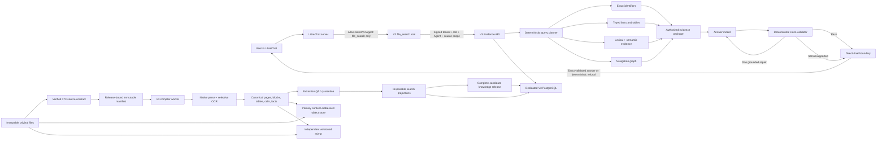
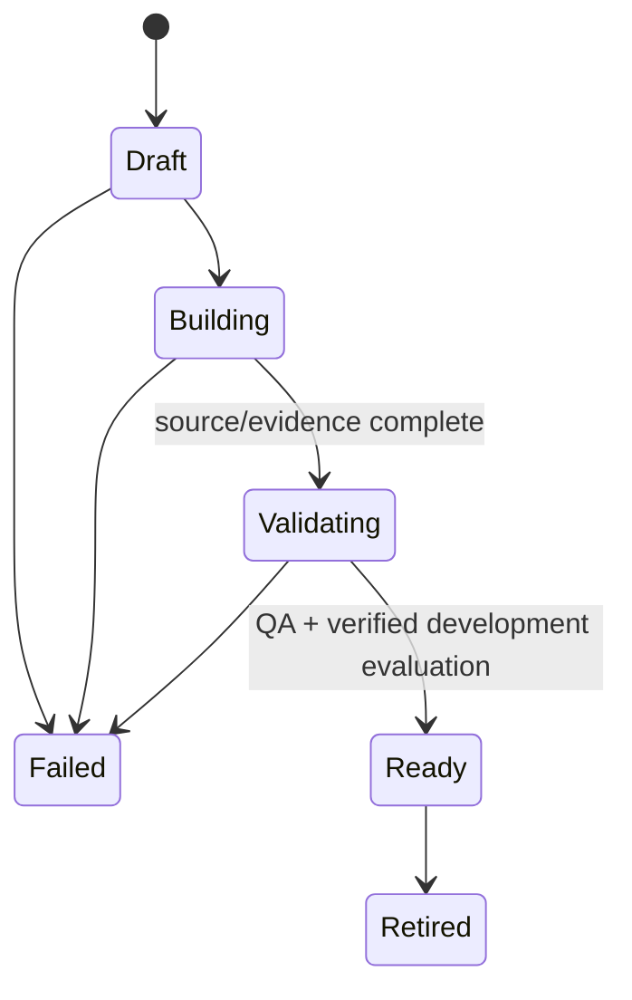

# Bauer RAG V3 architecture

Date: 2026-07-25

## System boundary



## Storage authority

| Layer | Authoritative | Rebuildable |
| --- | --- | --- |
| Original source bytes and hashes | Yes | No |
| Canonical page/table/fact evidence | Yes | Yes, from pinned source and tool versions |
| Knowledge-release manifest | Yes | Yes, deterministically |
| Exact/lexical/vector/navigation projections | No | Yes |
| Generated category/artifact summaries | No; navigation only | Yes |
| Active-release pointer | Yes for serving | Changed atomically |

The object store uses content-addressed keys and verifies SHA-256 on reads and writes. Production
requires an independent mirror because a single Railway bucket is not the archival authority.

The frozen original-source contract contains 373 selected originals (166 PDF and 207 HTML), plus
177 duplicate aliases that account for all 550 reviewed PDF/HTML inputs. The selected bytes total
503,391,181 and the contract SHA-256 is
`40049a12aacb198018a633905d793c8ef9011403f3fdbcd34ed7fe0792ab2580`. Its two-level source-path
taxonomy is a non-citable navigation aid, not evidence. The contract must be verified against the
original corpus, bound to the target tenant/KB/release UUIDs, and then converted to an immutable
release manifest before compilation.

## Request invariant

Each request pins one ready release before retrieval:

```text
verified signed scope
  -> configured deployment scope match
  -> one release lookup:
       normal API = atomic active pointer
       shadow API = deployment-fixed ready candidate UUID
  -> authorized source intersection inside every SQL channel
  -> deterministic fusion
  -> citable evidence only
  -> generation
  -> validation
  -> exact direct-final response or deterministic refusal
```

A release activation during a request cannot mix old and new evidence: the pinned release ID is an
explicit condition on every subsequent query.

The shadow path is deliberately fixed at process configuration. It accepts no release ID from a
client or signed request, requires the candidate to be `ready` and readable in the configured
tenant/KB/principal scope, and does not consult or mutate `active_releases` for request selection.
Its `/ready` result is tied to that same fixed candidate. Normal deployments omit the candidate
setting and continue to use only the atomic active pointer.

For an allow-listed private V3 Agent, the LibreChat graph is sealed to `file_search` only:
`toolEnd=true`, no connected Agents, no subagents, and no additional tools. Model-authored text and
reasoning from the routing turn are suppressed. LibreChat persists and returns the exact V3 answer
only when one valid direct-final envelope is present; missing, malformed, unauthorized, or multiple
tool completions fail closed with a fixed refusal. This boundary is selected only by
`BAUER_V3_AGENT_IDS`; V1 and V2 routing is unchanged.

## Compiler invariant

```text
manifest entry
  -> verify original byte count + SHA-256
  -> immutable object write + mirror verification
  -> deterministic source/source-version/artifact IDs
  -> parser candidates
  -> extraction-quality selection
  -> selective OCR only for deficient pages
  -> canonical evidence transaction
  -> release-specific projection transaction
  -> artifact finalization
```

Low-confidence or structurally invalid extraction is quarantined. It cannot silently disappear
from release completeness accounting and cannot be activated.

Production workers must have OCR enabled. Detection, recognition, and classification model paths
and their SHA-256 hashes are required; languages, minimum confidence, and render DPI are explicit
compiler inputs. Runtime model downloads are forbidden. OCR is selected page by page when native
extraction is deficient, but the production capability itself is mandatory so image-only or
low-quality pages cannot be silently skipped.

## Release lifecycle



Activation is deliberately outside the status state machine. A guarded transaction changes the
single active pointer and records the prior release. Rollback runs the same transaction targeting
the earlier ready release.

Production activation additionally requires a passing evaluation against
`independent_bauer_verified` gold and an approved independent-review attestation bound to the
exact suite-manifest digest and signed review-packet digest. A ready release may therefore remain
an unserved candidate.

## Security and audit boundary

Schema migration 010 narrows five runtime roles after the earlier bootstrap: reader, ingester,
evaluator, independent reviewer, and admin. Runtime group roles are `NOLOGIN`, non-superuser,
non-owner, and
`NOBYPASSRLS`; every non-bootstrap process verifies its exact role tier and rejects unexpected
inherited V3 groups. Readers can select only serving evidence; ingesters can mutate the bounded
compiler/queue surface but cannot change release lifecycle, active pointers, ACLs, review
decisions, or evaluation gold. The evaluator can append guarded review/evaluation records but
cannot attest, activate releases, or change ACLs. The reviewer can create one immutable
manifest-bound independent decision but cannot run evaluations or activate a release. Release
control uses the parallel admin group for explicit control-plane work and can inspect, but not
manufacture or rewrite, evaluation evidence or review attestations.

Schema migration 011 scopes every RLS policy to those runtime groups. Write and admin `FOR ALL`
policies therefore do not participate in ordinary reader `SELECT` queries, and the reader is not
granted execution rights on write or control-plane predicates.
Migration 012 makes the source-registry write predicate safe for both the initial insert and its
identity-verifying conflict retry by checking the proposed/existing row's tenant and knowledge-base
ingest capability; it does not widen the compiler's object grants.
Migration 013 preserves the compiler-QA guard's release-lifecycle row lock through a trigger-only,
schema-owner execution boundary. Runtime groups cannot execute that function directly, and the
ingester remains unable to update release-control rows.
Migration 014 makes release membership append-only for the compiler: retries use insert-or-ignore
plus an exact RLS-protected identity check, and the ingester's former no-op update grant is revoked.
Migration 015 exposes that operation only through a tenant/KB/source/release-validating
security-definer function. It lets PostgreSQL take the parent release key-share lock while the
ingester retains no update authority on release lifecycle or direct membership-write privilege.

Authorization decisions and final validator dispositions are emitted as structured, body-free
logs and bounded OTLP metrics. In-scope authorization decisions are also appended through a
scope-checking security-definer function to the RLS-protected `authorization_audit` table. The
table rejects updates and deletes. Tokens, queries, answers, and source bodies are not stored in
that audit trail.

## Evaluation boundary

Evaluation always names one tenant, knowledge base, release, source scope, and split. Query/answer
shadow evaluation uses a dedicated API process fixed by
`BAUER_V3_CANDIDATE_RELEASE_ID` to exactly one authorized `ready` candidate. Canonical extraction
and table evaluation bypasses the answer model: a separate reader-only DSN captures the declared
targets from one release-pinned, repeatable-read PostgreSQL snapshot. Evaluation persistence uses
a dedicated exact `bauer_rag_v3_evaluator` credential separate from both the reader DSN and the
release-control `bauer_rag_v3_admin` credential. Independent review uses a fifth exact
`bauer_rag_v3_reviewer` credential; this separation prevents a routine evaluator from minting its
own production gold approval.

There is currently no built V3 candidate release, V3 benchmark result, V3 Railway deployment, or
live V3 Agent route. The remaining external gates are a real PostgreSQL migration/RLS exercise,
managed PostgreSQL and mirrored object storage, pinned model and OCR assets, a full 373-source
build, real-corpus execution and source review of the portable difficult-document fixtures, V2/V3
shadow comparison, independent Bauer gold signoff, and separate explicit approval before
deployment or activation.

## First infrastructure shape

- One private V3 API service.
- One private V3 compiler worker service, scaled horizontally through PostgreSQL job leases.
- One explicit migration job.
- One dedicated PostgreSQL database with `pgvector` and `pg_trgm`.
- One S3-compatible primary object store and one independent versioned mirror.
- Existing LibreChat with an additive private V3 Agent allow-list.
- Existing model and embedding endpoints.
- OTLP export for traces and metrics.

Kafka, Kubernetes, Redis, Elasticsearch, Neo4j, and a separate vector database are intentionally
absent until measured throughput or availability requirements justify them.
