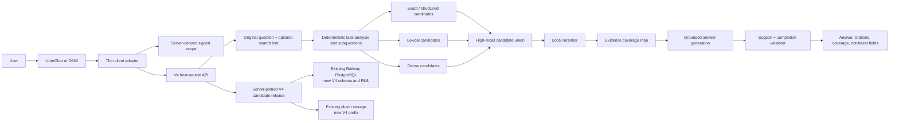

# Bauer RAG V4 architecture and delivery plan

Date: 2026-07-29

Status: proposed planning baseline; not implemented or deployed

Target: company-grade, client-independent evidence retrieval for LibreChat and future ONIX use

## 1. Executive verdict

V4 should not be a larger V3 and should not be a clean-room rewrite.

The correct engineering direction is:

> **Retain V3's evidence authority, provenance, authorization, immutable-release, and isolation
> controls; recover V2's corpus-aware representation quality; replace V3's retrieval and
> application boundary with a smaller, measurable, client-independent path.**

V3 underperformed primarily because information was lost before and during retrieval:

1. typed table values and units were not persisted;
2. multi-row table semantics, captions, paths, and footnotes were not reliably projected;
3. document metadata was not represented as complete document evidence;
4. LibreChat's shortened search query replaced the full user question;
5. multiple legitimate searches triggered a fail-closed boundary;
6. validation rewarded support without adequately measuring task completion; and
7. readiness did not require the full named benchmark.

The security and release architecture did not cause those relevance failures. Replacing it would
discard working controls without repairing the data path.

V4 therefore has two deliberate movements:

- **simplify the request, retrieval, ranking, and answer-control flow;**
- **deepen the compiler, canonical representation, and evaluation gates.**

The first V4 private shadow should reuse the existing V3 Railway compute and storage capacity. It
should use a new logical schema, roles, object prefix, release namespace, API route, and private
LibreChat Agent. It must not create another always-on PostgreSQL, worker, migrator, or API service
unless measured capacity proves that reuse is unsafe.

## 2. Decision status and boundaries

This document authorizes planning and defines the intended implementation. It does not authorize:

- a Railway mutation;
- creation or modification of a LibreChat Agent;
- an active-release change;
- opening the locked holdout;
- production promotion;
- deletion of V3 data or evidence;
- changes to the V1 or V2 Agent IDs.

V4 is a proposed system. V1, V2, and the V3 private-shadow evidence remain the current factual
baseline.

## 3. Evidence baseline

### 3.1 Comparable answer results

The corrected run used the same 30 interim-reviewed development prompts through the authenticated
LibreChat API for V1, V2, and V3.

| Measure | V1 | V2 | V3 private shadow |
| --- | ---: | ---: | ---: |
| Exact visible answers | 29/30 | 30/30 | 30/30 |
| Exact-answer accuracy | 0.0333 | 0.0667 | 0.0667 |
| Claim-level correctness | 0.3333 | 0.6667 | 0.0952 |
| Constraint compliance | 1.0000 | 0.9667 | 0.7000 |
| Safe-refusal accuracy | 0.7500 | 0.7500 | 0.5000 |
| Fabrication findings | 34 | 57 | 19 |
| Hard failures | 23 | 22 | 16 |
| End-to-end p50 | 31.29 s | 22.60 s | 22.49 s |
| End-to-end p95 | 198.71 s | 105.11 s | 164.03 s |

The exact-answer metric is strict and sometimes under-credits useful content. The direction remains
clear because claim correctness, direct retrieval, constraint completion, and representative exact
outputs agree.

On the 20 public, non-synthetic evidence cases:

| Measure | V1 | V2 | V3 |
| --- | ---: | ---: | ---: |
| Claim success | 0.1875 | 0.6562 | 0.0938 |
| Constraint compliance | 1.0000 | 0.9500 | 0.7000 |
| Median answer length | 1,126 chars | 1,020 chars | 380 chars |
| Explicit refusals | 1 | 0 | 5 |

This rules out synthetic Technical Twin data as the main explanation for V3's loss.

### 3.2 Direct retrieval results

| Measure | V1 | V2 | Corrected V3 |
| --- | ---: | ---: | ---: |
| Recall@1 | 0 | 0.5083 | 0.0667 |
| Recall@3 | 0 | 0.6167 | 0.2167 |
| Recall@5 | 0 | 0.6167 | 0.2667 |
| Recall@10 | 0 | 0.6167 | 0.3917 |
| MRR | 0 | 0.6250 | 0.2335 |
| Exact metadata | 0 | 0.5556 | 0 |
| Table integrity | 0 | 0.2308 | 0 |
| p50 | 32.92 ms | 1,068.45 ms | 2,261.21 ms |
| p95 | 39.97 ms | 1,962.58 ms | 8,233.47 ms |

V2's earlier tuned development run reached Recall@5 `0.8667`, exact lookup `1.0000`, and table
integrity `0.6923`. The later three-way run is the fair same-time comparison, while the tuned
result shows the capability already demonstrated by V2's representation and retrieval design.

### 3.3 V3 answer-path behavior

The corrected 30-answer V3 capture contained:

- 17 extractive fallback answers beginning with `Evidence states:`;
- 6 backend refusals;
- 4 fixed integration-boundary refusals;
- 1 explicit not-found response;
- approximately 2 normal generated answers.

Twenty-three answers were shorter than 500 characters. Ten were explicit boundary or evidence
refusals. The reduced fabrication count is therefore partly a consequence of shorter and more
defensive output, not a general improvement in answer quality.

### 3.4 Live table-data finding

A read-only query against the deployed V3 shadow database returned:

| Field | Count |
| --- | ---: |
| Total `table_cells` | 120,950 |
| Non-null `numeric_value` | 0 |
| Non-null `unit_raw` | 0 |
| Non-null `unit_ucum` | 0 |

The deployed compiler inserts nulls for these table-cell fields. The runtime then relies on them for
numeric and unit-aware table filtering. This makes the typed table channel structurally present but
functionally empty.

## 4. Technical review of V1, V2, and V3

### 4.1 V1: useful semantic baseline, insufficient exactness

V1 uses the existing LibreChat RAG API and vector similarity over ordinary chunks. It established
that:

- all 373 authorized Bauer documents can be searched;
- semantic passages can be retrieved and cited;
- the operational file permission boundary works;
- the same Agent can combine public Bauer documents and a separate structured search tool.

Its limitations are expected for generic dense retrieval:

- exact document, certificate, model, and part identifiers are unreliable;
- table rows lose header, unit, caption, and footnote relationships;
- numeric extrema and hard constraints are not reliably resolved;
- long multi-part answers can become verbose and fabricate connections.

V1 should remain a regression and rollback reference, not a V4 code base.

### 4.2 V2: the current quality leader

V2 added a versioned derived index and combines:

- exact metadata search;
- PostgreSQL lexical search;
- dense vector search;
- Bauer-specific table row extraction;
- deterministic query and result fusion;
- identifier, unit, document, table, and multilingual signals.

The most important V2 advantage is not its fusion formula. It is the representation created by its
corpus-specific extraction:

- pipe-table parsing;
- flattened technical-table parsing;
- key-value-table parsing;
- identifier-table parsing;
- table title and section path in row content;
- header and unit text beside row values;
- nearby footnotes preserved with the row.

This makes imperfect source conversion searchable in the vocabulary used by real questions.

V2 also benefited from multiple measured development iterations. Retrieval failures were inspected
against exact source locations and the derived index was adjusted until the relevant page or row
ranked highly.

V2's weaknesses remain:

- the Markdown-derived index is not a sufficient evidence authority;
- extraction rules are partly corpus-specific and can be brittle;
- authorization and release controls are weaker than V3;
- the fusion layer already contains growing hand-written query bonuses;
- answer validation does not provide the evidence-control guarantees intended for company use;
- the service contract remains tied to the existing RAG/LibreChat shape.

V4 should reuse V2 parsing logic as tested parser candidates and regression oracles, not adopt the
entire V2 service as its final architecture.

### 4.3 V3: strong controls around a weak information path

V3 correctly introduced:

- immutable original-source contracts;
- content-addressed canonical artifacts;
- canonical evidence separated from disposable search projections;
- release-specific compilation;
- fixed-candidate shadow serving;
- isolated PostgreSQL and object storage;
- signed Agent, tenant, knowledge-base, and source scope;
- PostgreSQL roles and RLS;
- append-only audit and evaluation concepts;
- deterministic answer validation and fail-closed behavior.

Those are legitimate company-deployment capabilities.

V3 underperformed for the following concrete reasons.

#### A. Typed table fields were never compiled

`postgres_compiler.py` writes `None` for table-cell numeric and unit values. No later process fills
them. `postgres_runtime.py` filters and ranks table candidates using those empty columns.

This is a compiler defect. Runtime weights cannot repair it.

#### B. Multi-row table meaning was not reconstructed

The projection selects a header row but does not reliably combine subsequent unit rows. Row
projections omit or weaken the table title, full section path, caption, and footnotes.

Real Bauer tables frequently distribute meaning across several rows. V3 indexed the cells but lost
the relationships needed to interpret them.

#### C. Fact extraction could not compensate

The fact path recognizes values and units when they occur in the same text cell. Many Bauer tables
put numeric values in data cells and units in a separate header row. Facts therefore become
unitless, and unit-aware fact filtering rejects them.

#### D. Exact metadata pointed at incomplete content

Filename, document number, and title terms were attached to a representative content block instead
of a complete document-metadata evidence record. Exact search could locate an identifier but return
a fax line, footer, or arbitrary paragraph that did not contain the requested title, language,
subject, and filename.

#### E. Relevant evidence fields were hidden from the model

The V3 prompt representation omitted fields such as complete filename, section path, footnotes, and
some unit/caption context. Hydrating metadata after candidate limiting also meant it could not
influence candidate generation or ranking.

#### F. The original question was lost

LibreChat generated a short `file_search` query. V3 treated this derived query as the question to
answer and validate.

Examples:

- the B23 metadata request became only `N47183`;
- B08 lost its second requested component and associated limits;
- B07 lost its unit and footnote requirements;
- B13 lost exact language and exclusion constraints.

The backend cannot enforce requirements it never receives.

#### G. Multiple searches caused fixed refusal

The final LibreChat boundary accepted exactly one tool output. Multi-part questions that caused two
search calls were rejected even when both searches were authorized and relevant.

This control protected a simple integrity invariant at the cost of legitimate task completion.

#### H. Validation optimized support, not usefulness

After generation and one repair, the fallback copied retrieved sentences into a validated answer.
This made lexical support easy to prove but did not ensure that the response answered the requested
fields or comparison.

The result was safe-looking evidence dumping rather than useful grounded synthesis.

#### I. Readiness measured the wrong evidence

The ready transition required one passing verified evaluation. It did not require the full named
suite, minimum case counts, answer-route coverage, or the documented retrieval/table thresholds.

A four-case evaluation with no direct answer cases could therefore satisfy readiness while the
complete benchmark remained unexecuted.

#### J. Parser selection measured structural success

Parser candidates were selected using completion state, issue count, table count, and parser
identity. The selection did not directly measure:

- reading order;
- title and section hierarchy;
- header-to-unit inheritance;
- footnote association;
- exact metadata completeness;
- benchmark retrieval quality.

A structurally valid parse was treated as a semantically faithful parse.

### 4.4 Root-cause conclusion

V3 is not evidence that canonical structured RAG is a bad idea. It is evidence that canonical
structure must be verified at the semantic level before a sophisticated runtime depends on it.

The ordering mistake was:

1. build the complete control and release system;
2. compile the corpus;
3. discover representation defects through retrieval;
4. compensate in a large runtime;
5. use a weak readiness gate.

V4 reverses that order:

1. define exact user and evidence contracts;
2. prove representation on difficult documents;
3. prove simple high-recall retrieval;
4. add reranking;
5. prove task completion;
6. integrate clients;
7. compile and deploy the full private shadow.

## 5. V4 goals and non-goals

### 5.1 Goals

V4 must:

- exceed the best demonstrated V2 retrieval quality on the same public development evidence;
- provide stronger evidence and authorization controls than V2;
- preserve the complete user task from client to answer validator;
- answer multi-part questions without host-specific tool-call restrictions;
- return complete document metadata and correctly reconstructed table values;
- distinguish supported answer fields from explicit missing fields;
- expose a stable host-neutral API usable by LibreChat and ONIX;
- be reproducible from immutable originals and tool identities;
- reuse existing infrastructure and cached artifacts by identity;
- make each quality layer independently testable and promotable.

### 5.2 Non-goals

The first V4 release will not:

- introduce a knowledge graph product;
- introduce more retrieval channels than exact/structured, lexical, and dense;
- train a custom foundation model;
- add autonomous multi-agent orchestration;
- replace LibreChat;
- implement the ONIX UI;
- open the locked holdout;
- activate a production release;
- require a new Railway database or always-on replica;
- use V2 Markdown as the evidence authority;
- preserve V3 runtime heuristics merely for compatibility.

## 6. Architecture principles

1. **Preserve the question.** The original question is immutable request data.
2. **Represent before ranking.** Retrieval tuning starts only after canonical QA passes.
3. **Canonical evidence is stable; projections are disposable.**
4. **Three candidate families are enough initially.**
5. **Reranking is separate from candidate generation.**
6. **Support and completion are different validation dimensions.**
7. **Partial answers are first-class.**
8. **Authorization is server-derived and release-pinned.**
9. **Clients are adapters, not owners of retrieval logic.**
10. **Readiness names exact evidence.**
11. **Reuse is based on identity, not convenience.**
12. **No new compute without a measured need.**

## 7. Reuse, adapt, replace

| Existing asset | Decision | V4 use |
| --- | --- | --- |
| 373-source immutable contract | Keep | Authoritative compilation scope |
| V3 original object artifacts | Reuse by hash | Avoid duplicate source transfer/storage |
| V3 manifest and content identity | Adapt | V4 release manifest adds schema/compiler contract |
| V3 PostgreSQL service and volume | Reuse physically | New `bauer_rag_v4` schema and V4 roles/RLS |
| V3 object bucket | Reuse physically | New immutable `v4/` prefix and bucket policy scope |
| V3 API/worker/migrator services | Reuse compute | Deploy V4-capable images without new replicas |
| V3 role/RLS patterns | Keep and simplify operationally | Preserve least privilege; remove unused workflow complexity |
| V3 canonical artifact concepts | Keep | Correct the representation and QA contracts |
| V3 table projections | Replace | They lack typed values and semantic context |
| V3 exact metadata projection | Replace | Dedicated document-metadata evidence |
| V3 many-channel runtime fusion | Replace | Three candidate families plus reranker |
| V3 answering/repair/fallback | Replace | Coverage-led answer with targeted partial response |
| V3 one-tool LibreChat boundary | Replace | Thin adapter preserving full question |
| V3 ready gate | Replace | Manifest-bound named quality gate |
| V2 table parsers | Adapt | Parser candidates, fixtures, and regression oracle |
| V2 metadata/entity extraction | Adapt | Bootstrap exact identifier and unit recognition |
| V2 tuned retrieval results | Keep as baseline | Minimum comparative quality floor |
| V2 derived Markdown | Reuse selectively | Parser candidate/diagnostic, never evidence authority |
| V1 vector route | Keep as baseline only | Regression comparison and operational rollback |
| Local AI models | Reuse initially | Same embeddings/chat for fair attribution |
| Existing benchmark runner | Adapt | Add V4 route and preserve exact outputs |

## 8. Target system architecture



The service returns one final response. Internally, one request may create several subqueries and
retrieve several evidence groups.

## 9. Repository and package structure

Implementation should begin in a new worktree or repository derived from the V3 Git history:

```text
D:\02_Code\LibreChat_Setup-rag-v4
```

This preserves provenance while allowing deliberate deletion. Proposed structure:

```text
services/bauer-evidence-v4/
  bauer_evidence_v4/
    contracts/
    authorization/
    canonical/
    ingest/
    projections/
    retrieval/
    reranking/
    answering/
    evaluation/
    storage/
    api/
  migrations/
  tests/
adapters/
  librechat/
  onix/
evals/bauer-rag-v4/
docs/
```

Rules:

- `contracts` may not import LibreChat or ONIX packages.
- adapters may import contracts but not canonical storage internals.
- retrieval consumes a release-pinned repository interface.
- answering consumes evidence packages, not database rows.
- evaluation calls public layer interfaces and may persist only through evaluator roles.

## 10. Host-neutral request and response contract

### 10.1 Request

The conceptual V4 request is:

```json
{
  "request_id": "opaque-id",
  "question": "complete original user question",
  "search_hint": "optional host-generated retrieval hint",
  "conversation_context": [],
  "locale": "de-DE",
  "client": {
    "type": "librechat",
    "instance": "testing"
  },
  "authorization": {
    "signed_scope": "in-memory signed assertion"
  }
}
```

Invariants:

- `question` is required and never replaced by `search_hint`.
- conversation context is bounded, typed, and optional.
- the adapter obtains authorized tenant, knowledge base, principal, and source IDs server-side.
- the client cannot select an arbitrary knowledge release.
- raw credentials and bearer tokens are never placed in the request body or persisted in traces.
- the API pins exactly one candidate or active release before retrieval.

### 10.2 Internal task plan

Task analysis produces:

```json
{
  "intent": ["exact_document_metadata", "table_lookup"],
  "constraints": [],
  "requested_fields": [],
  "subquestions": [],
  "must_not_substitute": [],
  "language": "de",
  "answer_shape": "table"
}
```

The first implementation should prefer deterministic parsing for identifiers, quoted strings,
units, comparisons, requested fields, and explicit exclusions. A bounded model call may propose
subquestions, but it may not remove constraints or silently broaden exact requests.

### 10.3 Response

```json
{
  "request_id": "opaque-id",
  "answer": "grounded answer text",
  "status": "complete",
  "coverage": [
    {
      "field": "motor_power",
      "status": "supported",
      "citation_ids": ["E-..."]
    }
  ],
  "not_found": [],
  "citations": [],
  "release": {
    "public_id": "opaque release identifier",
    "compiler_identity": "digest"
  },
  "trace_id": "opaque-id"
}
```

Valid statuses are `complete`, `partial`, `not_found`, and `refused`. A `partial` answer must state
which requested fields are unsupported. A refusal must name the policy class without revealing
authorization details.

## 11. Canonical evidence model

### 11.1 Required records

V4 must represent:

- source object;
- source version and checksum;
- document metadata;
- page;
- section hierarchy;
- text block and source span;
- table;
- table caption/title;
- table row and column;
- cell;
- header tree and header path per data cell;
- unit declaration and normalized unit;
- footnote and footnote references;
- typed fact;
- citable evidence unit;
- disposable search projection.

### 11.2 Dedicated document-metadata evidence

Every source receives a complete document-metadata evidence unit containing, where available:

- original filename;
- external file ID;
- document number;
- document title;
- language;
- subject/product family;
- revision/version;
- publication/effective date;
- source type;
- page count;
- authority and provenance.

Exact identifiers point to this evidence record, not to an arbitrary content block.

### 11.3 Table representation

Each table stores the original grid and reconstructed semantics:

- row and column coordinates;
- row/column spans;
- header versus data-cell role;
- ordered header path for each data cell;
- raw value;
- normalized numeric value;
- raw unit;
- normalized unit;
- qualifier and range;
- caption/title;
- page and section path;
- footnote links;
- model/product row identity;
- provenance to source coordinates.

The searchable row projection must include:

```text
Document title and number
Section path
Table title/caption
Model or row key
Header path + unit + raw value for each requested field
Relevant footnotes
Page and source identity
```

This projection is generated from canonical relationships. It is not the canonical table.

### 11.4 Typed values

Numeric and unit extraction occurs after header inheritance, not per isolated cell.

The compiler must distinguish:

- scalar values;
- ranges;
- lower/upper bounds;
- approximate values;
- qualified values;
- list values;
- identifiers that resemble numbers;
- unitless counts;
- missing values and ditto marks.

UCUM normalization is stored beside the raw unit. The raw printed value remains citable.

## 12. Compiler design

### 12.1 Parser candidates

For each source, generate candidate canonical parses from applicable inputs:

1. source-native PDF layout extraction;
2. source-native HTML DOM extraction;
3. OCR/layout fallback for image-based pages;
4. V2 normalized Markdown parser candidate;
5. V2 corpus-specific table parsers.

The original file remains authoritative. A derived candidate must preserve source coordinates or be
linked to a verifiable original span before it can become citable.

### 12.2 Semantic parser selection

Candidate selection uses a scored QA contract:

- document metadata coverage;
- reading-order agreement;
- section hierarchy;
- expected page count;
- table grid consistency;
- header/unit association;
- footnote association;
- exact identifier retention;
- raw text coverage;
- golden-fixture correctness.

Table count is diagnostic, not a quality proxy.

If candidates disagree on a golden-required field, the source fails compilation or is quarantined.
The compiler does not choose the superficially richest parse.

### 12.3 Difficult-document fixture set

Before full compilation, create reviewed fixtures for the documents behind:

- B07: exact table, units, and footnotes;
- B13: exact certificate and exclusion behavior;
- B16: multi-unit technical row;
- B17: exact table row;
- B23: document number and full metadata;
- B29: family-level product range;
- B30: bilingual table lookup.

Add representative HTML, clean PDF, flattened PDF, scanned PDF, multi-page table, and bilingual
documents. Each fixture declares exact source coordinates and expected canonical relationships.

### 12.4 Compiler invariants

A release cannot proceed if:

- any expected source is absent or has the wrong hash;
- a citable source lacks a document metadata record;
- a table data cell has no resolvable header path where the source provides one;
- a numeric-looking golden cell has no typed numeric representation;
- a declared unit row is not linked to its value columns;
- a golden footnote is not linked to the row/cell it qualifies;
- a projection references a non-canonical evidence ID;
- extraction QA uses a different compiler identity from the release.

## 13. Projection and embedding strategy

### 13.1 Projection families

Only these projection families are required:

1. document metadata;
2. page/section passage;
3. table row;
4. typed fact.

They feed three candidate generators; they are not four independent fusion channels.

### 13.2 Search text

Search text includes human-readable context required to interpret the unit:

- title and document number;
- section path;
- table title;
- row/model identity;
- header paths and units;
- values and qualifiers;
- footnotes relevant to the unit.

### 13.3 Embedding reuse

Cache embeddings by:

```text
embedding model identity + dimensions + normalized projection text hash
```

Reuse an existing vector only when all identity fields match. Because V4 corrects projection text,
many table and metadata projections must be re-embedded. Unchanged paragraph projections can reuse
vectors by content identity.

Embedding reuse is an optimization after projection correctness, never a reason to preserve flawed
text.

## 14. Retrieval and reranking

### 14.1 Query analysis

The analyzer extracts:

- exact identifiers and document numbers;
- quoted strings;
- product/model families;
- requested metadata fields;
- requested table fields;
- numeric constraints and units;
- comparison and extremum operators;
- language;
- exclusions and non-substitution rules;
- multi-part subquestions.

The analyzer retains every original constraint. Search-term expansion is additive.

### 14.2 Candidate generation

Use three candidate families:

1. **Exact/structured**
   - normalized identifier lookup;
   - document metadata fields;
   - typed numeric/unit predicates;
   - table row/model keys.
2. **Lexical**
   - PostgreSQL full-text/BM25-equivalent ranking;
   - trigram/fuzzy matching for OCR and typography variants;
   - bilingual terminology aliases.
3. **Dense**
   - current 1,024-dimensional local embedding model initially;
   - semantic retrieval over the same authorized release projections.

Each subquestion retrieves a generous authorized candidate set. The union is deduplicated by
canonical evidence identity before reranking.

### 14.3 Reranking

Use a separate local reranker over the top candidate union. Evaluate:

- a local cross-encoder suitable for German/English technical content;
- a bounded local LLM reranker with deterministic structured output;
- a simple learned or calibrated feature model as fallback.

Selection is benchmark-driven. The reranker sees:

- the full subquestion;
- original constraints;
- complete candidate search text;
- evidence type;
- exact-match features;
- numeric/unit compatibility.

It does not see unauthorized evidence.

If no reranker improves Recall/NDCG without unacceptable latency, retain a transparent calibrated
baseline. Do not hide weak candidate generation behind a model.

### 14.4 Evidence coverage

Before answer generation, build a coverage matrix:

| Requested item | Evidence state |
| --- | --- |
| exact identifier | supported / contradicted / absent |
| requested field | supported / ambiguous / absent |
| requested comparison side | supported / absent |
| unit and qualifier | supported / inherited / ambiguous |
| exclusion constraint | satisfied / violated |

Generation receives this matrix and the selected evidence. Missing fields remain explicit.

## 15. Answering and validation

### 15.1 Answer generation

The answerer receives:

- the complete original question;
- requested answer shape;
- constraint list;
- coverage matrix;
- complete evidence citations;
- a strict instruction not to fill absent fields.

It may produce a complete or partial answer. It must not manufacture a single confident answer from
conflicting evidence.

### 15.2 Citation contract

Every citation passed to the model includes:

- evidence ID;
- source title;
- original filename;
- document number where present;
- page;
- section path;
- table title;
- header path;
- raw and normalized value/unit where applicable;
- relevant footnotes;
- source excerpt.

The visible citation format can vary by client. The underlying evidence identity does not.

### 15.3 Validation dimensions

Validate separately:

1. authorization and release identity;
2. citation existence and scope;
3. claim support;
4. numeric/unit support;
5. exact identifier support;
6. requested-field completion;
7. constraint and exclusion compliance;
8. contradiction handling;
9. safe absence/refusal behavior;
10. response-shape compliance.

### 15.4 Repair and fallback

Allow at most one targeted repair that receives machine-readable validation defects.

If repair still fails:

- preserve validated supported fields;
- remove unsupported claims;
- return `partial` with field-level missing/ambiguous states; or
- return `not_found`/`refused` when no supported answer remains.

Never concatenate all evidence sentences as a fallback.

## 16. Authorization, RLS, release, and audit

### 16.1 Authorization

The host adapter derives:

- client identity;
- principal identity;
- tenant;
- knowledge base;
- authorized external source IDs;
- request expiry and nonce.

It signs a short-lived assertion. The V4 API verifies the signature, audience, expiry, nonce, client,
tenant, KB, and source scope. It intersects the scope with the pinned release membership.

### 16.2 Database isolation

Reuse the physical V3 PostgreSQL service with:

- a new `bauer_rag_v4` schema;
- V4-specific roles;
- explicit RLS policies;
- no grants to V3 runtime roles unless intentionally shared through a read-only source-identity
  interface;
- migration rehearsal on isolated Fedora PostgreSQL first.

Prefer the proven V3 least-privilege role pattern. Simplification should remove unused operational
workflow, not collapse security boundaries.

### 16.3 Releases

Each V4 release records:

- source contract digest;
- canonical schema version;
- compiler commit and dependency/tool identities;
- parser selection manifest;
- projection version;
- embedding identity;
- reranker identity;
- evaluation gate manifest and result digest.

Private shadow serving uses a server-configured candidate release. The client cannot provide a
release ID. No active pointer is changed during private-shadow development.

### 16.4 Audit

Record minimal structured events:

- request and trace IDs;
- principal/tenant/KB pseudonymous identifiers;
- release;
- authorized source count;
- selected evidence IDs;
- result status;
- validator defects;
- latency per stage.

Do not store tokens, credentials, full source bodies, or unrestricted question/answer text in the
authorization audit. Diagnostic content logging must be separately controlled and redacted.

## 17. LibreChat adapter

The LibreChat adapter must:

1. use the server-side Agent permission filter;
2. preserve the complete original user message;
3. treat LibreChat's `file_search` query only as an optional search hint;
4. send one V4 API request per user task;
5. allow V4 to decompose the task internally;
6. persist and display the exact V4 final response;
7. map evidence citations into LibreChat's visible source format;
8. avoid a second unconstrained synthesis step;
9. avoid the exactly-one-tool-output rule;
10. keep the existing browser-shaped authenticated API approach for regression capture.

Create a new private V4 Agent for live comparison. Do not reuse the V1 or V2 Agent IDs. Preserve
the V3 Agent and evidence identity unless a later explicit decision retires its live route.

## 18. ONIX portability and future adapter

No ONIX-specific UI or authentication contract is currently present in the inspected repositories.
V4 therefore defines a stable integration boundary without inventing ONIX implementation details.

The future ONIX adapter will:

- map an ONIX user/session/organization to V4 principal, tenant, and KB scope;
- pass the original ONIX question unchanged;
- optionally pass UI-selected project/product/document filters as typed constraints;
- call the same V4 API used by LibreChat;
- render answer status, citations, coverage, and missing fields in ONIX-native components;
- keep conversation persistence and UI state inside ONIX;
- keep retrieval, release, evidence, and validation logic inside V4.

An OpenAPI specification and contract test kit must be part of V4 before LibreChat integration is
declared complete. ONIX later implements the same tests.

## 19. Evaluation system

### 19.1 Independent evaluation layers

| Layer | What it proves |
| --- | --- |
| Source contract | Correct 373 originals and immutable identity |
| Canonical extraction | Reading order, metadata, tables, units, footnotes |
| Projection | Search text faithfully contains canonical meaning |
| Candidate generation | Relevant evidence enters the reranker set |
| Reranking | Correct evidence ranks in the answerable window |
| Evidence coverage | Every requested field is supported/absent/ambiguous |
| Answer | Claims, constraints, citations, refusal, completeness |
| Client adapter | LibreChat/ONIX preserves question, scope, and response |
| Operations | Latency, errors, release pinning, isolation, rollback |

An aggregate score may summarize a run but may not hide a failed layer.

### 19.2 Development suites

Use:

- reviewed difficult-document compiler fixtures;
- current public 30-case V1/V2/V3 development suite, extended with a V4 route;
- authorization-negative cases;
- multi-part question cases;
- bilingual German/English cases;
- exact metadata, certificate, part, table, pressure, and family-range cases;
- adapter contract tests.

The locked holdout remains closed.

### 19.3 Initial V4 gates

These are minimum proposed development gates and must be encoded in a gate manifest:

| Gate | Minimum |
| --- | ---: |
| Source-contract match | 373/373, zero unexpected |
| Golden document metadata fields | 1.0000 |
| Golden exact identifiers retained | 1.0000 |
| Golden table header/unit association | >= 0.9500 |
| Golden caption/section/footnote association | >= 0.9500 |
| Numeric-looking golden cells typed | >= 0.9800 |
| Exact metadata retrieval | 1.0000 |
| Table integrity | >= 0.9000 |
| Recall@5 | >= 0.9000 and above best V2 baseline |
| Recall@10 | >= 0.9500 |
| Claim correctness | >= 0.8000 |
| Constraint compliance | >= 0.9500 |
| Safe-refusal accuracy | >= 0.9000 |
| Citation correctness | 1.0000 for high-severity claims |
| Unauthorized evidence returned | 0 |
| Multi-part requested-field coverage | >= 0.9000 |
| LibreChat question-preservation tests | 100% |
| End-to-end p50 | <= 30 s |
| End-to-end p95 | <= 90 s |
| Unhandled request failures | 0 in the 30-case run |

If a target proves invalid, update the gate manifest through an explicit reviewed decision before
the run. Do not reinterpret a failed metric after observing results.

### 19.4 Readiness contract

A release can become `ready` only when the release gate names and verifies:

- exact suite ID and digest;
- split;
- exact minimum case count;
- required extraction fixture set;
- required retrieval metrics;
- required answer metrics;
- required LibreChat route;
- source manifest;
- code/compiler/projection/model/reranker identities;
- authorization-negative results;
- zero hard blockers;
- reviewer decision where required.

`passing_verified_eval_count >= 1` is not a valid readiness rule.

## 20. Ordered work packages

### WP0 — Freeze factual baseline

Work:

- record Git status and exact commits for V1/V2/V3/LibreChat/wiki;
- hash the corrected benchmarks and rollback evidence;
- capture read-only Railway resource, deployment, volume, and release state;
- capture current V3 schema/table population statistics without secrets;
- preserve unrelated dirty files.

Exit:

- one baseline manifest can reproduce every factual statement in this plan.

Stop if:

- evidence hashes or deployed identities do not match the handover.

### WP1 — Create V4 repository and contracts

Depends on: WP0.

Work:

- create `LibreChat_Setup-rag-v4` from V3 history;
- delete obsolete V3 runtime complexity only after contract tests cover retained behavior;
- define request, response, evidence, release, and adapter contracts;
- produce OpenAPI and JSON Schema artifacts;
- create architecture dependency tests.

Exit:

- host-neutral contracts compile and have backward/invalid-payload tests;
- no core contract imports LibreChat/ONIX code.

### WP2 — Build reviewed difficult-document fixtures

Depends on: WP0.

Work:

- locate exact source files/pages for B07/B13/B16/B17/B23/B29/B30;
- create canonical expected metadata/table/header/unit/footnote relationships;
- add representative parser variants;
- record human-review state and source hashes.

Exit:

- fixtures independently express the information V4 must preserve.

Stop if:

- expected evidence cannot be verified against an unlocked original.

### WP3 — Implement V4 canonical compiler

Depends on: WP1, WP2.

Work:

- implement document metadata records;
- reconstruct table grids and multi-row header paths;
- inherit units and qualifiers;
- associate captions, sections, and footnotes;
- populate typed cells and facts;
- retain exact provenance;
- run multiple parser candidates and semantic QA;
- quarantine unresolved sources.

Exit:

- all compiler gates pass on the fixture set;
- typed table columns are demonstrably populated;
- every projection is traceable to canonical evidence.

Do not proceed to retrieval tuning if compiler gates fail.

### WP4 — Implement projections and embedding cache

Depends on: WP3.

Work:

- generate metadata, passage, table-row, and fact projections;
- verify required context in search text;
- reuse embeddings only by exact identity;
- embed changed projections on Fedora;
- test deterministic regeneration.

Exit:

- identical inputs produce identical projections and identities;
- V2/V3 failure examples contain the previously missing context.

### WP5 — Implement candidate generation

Depends on: WP4.

Work:

- exact/structured retrieval;
- lexical/trigram retrieval;
- dense retrieval;
- authorization and release filtering in every query;
- candidate union and canonical deduplication;
- per-subquestion retrieval.

Exit:

- Recall@10 target passes before reranking;
- authorization-negative tests return no candidate leakage.

Stop if:

- exact metadata or table integrity remains below its gate.

### WP6 — Select and implement reranker

Depends on: WP5.

Work:

- benchmark transparent and local model rerankers;
- measure relevance, multilingual behavior, latency, and resource use;
- select the smallest option that passes;
- retain deterministic tie-breaking and traceable features.

Exit:

- Recall@5 and ranking metrics pass with the selected evidence window;
- latency budget remains feasible.

### WP7 — Implement coverage, answering, and validation

Depends on: WP6.

Work:

- task analysis and subquestions;
- requested-field coverage matrix;
- grounded complete/partial answers;
- exact citation envelope;
- support and completion validators;
- one targeted repair;
- no dump fallback.

Exit:

- answer gates pass on direct V4 evaluation;
- every incomplete answer names missing fields;
- no extractive dump behavior remains.

### WP8 — Fedora database and security rehearsal

Depends on: WP3–WP7.

Work:

- create isolated V4 database/schema/roles;
- rehearse every migration and rollback;
- exercise RLS positive/negative tests;
- compile a representative subset;
- run API/worker failure recovery;
- verify release pinning and audit redaction.

Exit:

- migration/RLS/security suite passes from a clean database;
- rollback leaves no mixed release;
- no secret appears in logs/evidence.

### WP9 — Reuse Railway infrastructure

Depends on: WP8 and explicit deployment authorization.

Work:

- capture a fresh rollback baseline;
- create only the V4 logical schema/roles/object prefix;
- reuse existing V3 physical PostgreSQL, bucket, API, worker, and migrator capacity;
- deploy V4-capable code with no new replicas;
- keep serving pinned to a V4 candidate;
- do not change an active-release pointer.

Exit:

- services are healthy;
- V1/V2 remain unchanged;
- V3 evidence remains intact;
- V4 is unreachable except through authorized private routes.

### WP10 — Compile the full 373-source V4 release

Depends on: WP9.

Work:

- verify source contract;
- reuse source objects by hash;
- compile all sources;
- account for success/quarantine/failure;
- generate projections;
- reuse/embed vectors by identity;
- run release-level extraction QA.

Exit:

- 373/373 accounted for;
- no unexplained quarantine;
- all release compiler gates pass.

Do not mark ready yet.

### WP11 — Direct development evaluation and correction

Depends on: WP10.

Work:

- run complete named extraction/retrieval/answer suites;
- compare V2 and V4 case by case;
- repair the earliest failing layer;
- create a new immutable release for compiler/projection changes;
- avoid runtime tuning against malformed representations.

Exit:

- the full gate manifest passes;
- evidence and results are immutable and reproducible.

### WP12 — LibreChat private-shadow integration

Depends on: WP11 and explicit Agent authorization.

Work:

- create one new private V4 file-search Agent;
- implement the full-question adapter;
- verify one request can cover multiple subquestions;
- run authenticated API regression using one browser-shaped login and an in-memory token;
- capture exact V1/V2/V3/V4 outputs for the same 30 prompts;
- run V1/V2 regressions.

Exit:

- exact visible V4 outputs are retained;
- client and direct results agree on scope and answer identity;
- no V1/V2 Agent or route changed.

### WP13 — Documentation and decision

Depends on: WP12.

Work:

- update the single wiki version review;
- extend the single exact benchmark page with V4 outputs;
- document architecture and ONIX contract;
- publish a clear private-shadow verdict;
- distinguish development success from production promotion.

Exit:

- a reader can understand the versions, results, causes, and V4 decision without following
  chronological tracking pages.

### WP14 — Future ONIX adapter

Depends on: ONIX product/auth contract and a passing V4 private shadow.

Work:

- map ONIX identities/scopes;
- implement the OpenAPI client;
- render coverage/citations;
- pass the shared adapter contract suite;
- add ONIX-specific usability and authorization tests.

Exit:

- ONIX and LibreChat receive equivalent V4 evidence behavior for equivalent authorized requests.

## 21. Railway resource plan

The intended first V4 deployment adds no always-on physical service.

| Capability | Physical resource |
| --- | --- |
| PostgreSQL | Existing `bauer-v3-shadow-postgres` service/volume |
| Object artifacts | Existing `bauer-v3-shadow-objects` bucket |
| API compute | Existing `bauer-v3-shadow-api` service |
| Compiler worker | Existing `bauer-v3-shadow-worker` service |
| Migrations | Existing `bauer-v3-shadow-migrator` service |
| Models | Existing Fedora/Local AI services |
| LibreChat | Existing LibreChat service plus a new logical private Agent |

Logical isolation:

- `bauer_rag_v4` schema;
- V4-prefixed database roles;
- `v4/` object prefix;
- V4 release IDs;
- V4 API route and signed audience;
- V4 Agent allow-list entry;
- V4 evaluation suite namespace.

The reused API process should expose the new V4 route and a frozen V3 compatibility route from one
replica so the private V3 Agent remains checkable without another always-on service. The V3 route
must remain pinned to its existing release and package behavior; new retrieval logic belongs only
to V4. If this compatibility boundary proves unsafe or materially complicates V4, retiring the live
V3 route requires an explicit decision, but its immutable data and benchmark evidence remain.

Create new physical compute only when one of these is measured:

- PostgreSQL storage/IO contention violates the latency budget;
- worker compilation affects V3/V4 serving;
- security policy requires a separate legal/administrative boundary;
- failure isolation cannot be achieved in the shared process;
- API memory/CPU requires independent scaling.

## 22. Testing strategy

### Unit

- header trees and spans;
- unit inheritance and normalization;
- numeric/range/qualifier parsing;
- document metadata;
- task constraints and exclusions;
- coverage states;
- citation serialization;
- readiness gate manifest.

### Property and invariant

- no projection without canonical evidence;
- no candidate outside authorized source IDs/release;
- deterministic identities;
- no missing required release identity;
- no answer claim without evidence;
- no completed status with missing required fields.

### Integration

- clean migration and rollback;
- RLS for every role;
- parser candidates against real fixtures;
- embedding cache identity;
- API release pinning;
- LibreChat full-question preservation;
- multi-subquery response;
- malformed/expired/replayed authorization scope.

### End to end

- complete 30-case same-prompt comparison;
- service restart during request;
- worker retry/dead-letter;
- candidate release unavailable;
- Local AI timeout;
- object-store read failure;
- PostgreSQL timeout;
- no-result and conflicting-result tasks.

## 23. Observability

Per request, measure:

- authorization time;
- task-analysis time;
- candidate counts per family/subquestion;
- exact and structured match reasons;
- reranker latency and score distribution;
- selected evidence types;
- requested-field coverage;
- generation and repair count;
- validation defect categories;
- result status;
- total latency;
- release/compiler/reranker identities.

Per release, measure:

- source accounting;
- parser selection distribution;
- quarantine reasons;
- metadata completeness;
- table/header/unit/footnote completeness;
- projection counts;
- embedding reuse rate;
- evaluation gate results.

Alerts should detect authorization failures, release mismatch, schema mismatch, candidate starvation,
high partial/refusal rates, and latency regressions. Do not make raw content logging a prerequisite
for observability.

## 24. Risks and mitigations

| Risk | Mitigation |
| --- | --- |
| Reusing physical V3 infrastructure couples failures | Separate schemas/roles/prefixes; fixed releases; rehearse rollback; measure contention |
| V2 parser rules overfit Bauer | Use them as candidates; require provenance and diverse fixtures |
| New parser still appears valid but loses semantics | Golden relationships and semantic QA before retrieval |
| Reranker masks weak candidates | Require Recall@10 gate before reranking |
| LLM subquery decomposition drops constraints | Deterministic constraint extraction and invariant comparison to original |
| Answer validator becomes another complexity center | Small independent validators; coverage matrix; no generic dump fallback |
| Embedding reuse preserves stale text | Cache only by model plus exact normalized projection hash |
| Full recompile consumes Fedora/Railway resources | Fixture-first development; content-addressed reuse; final compile only after gates |
| Wiki becomes a tracking archive | One version review, one benchmark, one integration page |
| ONIX assumptions harden prematurely | Stable host-neutral contract; keep ONIX adapter thin and deferred |

## 25. Explicit stop conditions

Stop and repair the failing layer when:

- the fixture compiler does not pass semantic table/metadata gates;
- exact metadata or table retrieval fails before reranking;
- Recall@10 is below the candidate-generation target;
- a reranker improves rank but violates latency without a measured tradeoff decision;
- the original question or any mandatory constraint is absent from the answerer input;
- any authorized request can observe an unauthorized evidence ID;
- a release identity differs across retrieval, evidence, and answer;
- a readiness decision cannot name its exact suite and metric evidence;
- a Railway mutation would affect V1/V2 without explicit authorization;
- a proposed optimization requires opening the locked holdout.

## 26. Definition of done

V4 private-shadow development is complete only when:

1. all 373 sources are accounted for in an immutable V4 candidate;
2. difficult-document compiler fixtures pass;
3. typed table fields are populated and used;
4. document metadata is complete and exactly retrievable;
5. candidate, reranking, answer, and client gates independently pass;
6. V4 exceeds V2 on the named retrieval and answer targets;
7. the full original question reaches generation and validation;
8. multi-part questions produce one complete or explicit partial response;
9. authorization/RLS/release-negative tests pass;
10. the candidate is pinned without an active-pointer change;
11. exact V1/V2/V3/V4 LibreChat outputs and scores are retained;
12. V1/V2 regressions pass;
13. rollback is rehearsed;
14. the wiki clearly labels V4 as private shadow rather than production;
15. the OpenAPI and adapter test kit are sufficient for later ONIX integration.

Production promotion is a separate decision and requires separate authorization and holdout policy.

## 27. Open questions requiring human input

- Which Bauer reviewers will approve the difficult-document canonical fixtures and eventual gold?
- What ONIX identity and organization model should map to tenant/KB authorization?
- Does company deployment require a physical data boundary beyond schema/RLS isolation?
- Which fields in questions/answers may be retained for production observability under company
  privacy policy?

These questions do not block local compiler and contract work. They block independent gold approval,
final ONIX authorization mapping, or production policy.

## 28. Sources

- `D:\02_Code\LibreChat_Setup\docs\bauer-rag-v3-shadow-deployment-handover-20260726.md`
- `D:\02_Code\LibreChat_Setup-rag-v3\docs\bauer-rag-v3-architecture.md`
- `D:\02_Code\LibreChat_Setup-rag-v3\docs\bauer-rag-v3-runbook.md`
- `D:\02_Code\LibreChat_Setup-rag-v2\docs\bauer-demo-findings.md`
- `D:\02_Code\LibreChat_Setup-rag-v2\docs\bauer-rag-v2-rollout-20260723.md`
- `D:\02_Code\LibreChat_Setup-rag-v2\docs\bauer-rag-v2-runbook.md`
- `D:\02_Code\LibreChat_Setup-rag-v2\services\rag-api-custom\bauer_rag_v2\extraction.py`
- `D:\02_Code\LibreChat_Setup-rag-v3\services\bauer-evidence-v3\bauer_evidence_v3\projections.py`
- `D:\02_Code\LibreChat_Setup-rag-v3\services\bauer-evidence-v3\bauer_evidence_v3\postgres_compiler.py`
- `D:\02_Code\LibreChat_Setup-rag-v3\services\bauer-evidence-v3\bauer_evidence_v3\postgres_runtime.py`
- `D:\02_Code\LibreChat_Setup-rag-v3\services\bauer-evidence-v3\bauer_evidence_v3\evidence.py`
- `D:\02_Code\LibreChat_Setup-rag-v3\services\bauer-evidence-v3\bauer_evidence_v3\answering.py`
- `D:\02_Code\LibreChat_Setup-rag-v3\services\bauer-evidence-v3\bauer_evidence_v3\postgres_admin.py`
- `D:\02_Code\LibreChat_Setup\tmp\v3-deploy\librechat-overlay-9496\services\librechat-custom\bauerV3FinalBoundary.js`
- `D:\02_Code\LibreChat_Setup\tmp\v3-deploy\evidence\librechat-three-way-development-benchmark-20260727-corrected.json`
- `D:\02_Code\LibreChat_Setup\tmp\v3-deploy\evidence\librechat-three-way-development-benchmark-20260727-corrected-score.json`
- `D:\02_Code\LibreChat_Setup\tmp\v3-deploy\evidence\three-way-retrieval-benchmark-after-11ea000.json`
